# Dokapon Gaiden - English

This is the English translation of the Super Famicom (SNES) videogame: 
ドカポン外伝 〜炎のオーディション～ 
Dokapon Gaiden 〜Honō no Audition〜

The 3rd game in the Dokapon series.

外伝 (gaiden) means 'Side Story'. It's often used in fiction for work that references previous one while not being a direct sequel.

## Game

4 players (Human or CPUs) take turns going around a board. The goal is to have the most gold at the end. You get gold from different sources: random events, fighting monsters, fighting other players (you take half of the gold of defeated opponents) or simply completing a lap around the board. 
While keeping gold is important as it is your final score, it can be used during the game to upgrade your gear and your stats to help you fight better. 

## Patch File

BPS Patch File v1.0 is available here : [Dokapon Gaiden - Honoo no Audition (English).zip](/patch/Dokapon%20Gaiden%20-%20Honoo%20no%20Audition%20(English)%201.0.zip) 
Also available on romhacking.net : [https://www.romhacking.net/translations/6648/](https://www.romhacking.net/translations/6648/)

It applies to the following ROM : 
File: Dokapon Gaiden - Honoo no Audition (Japan) 
No-Intro: Super Nintendo Entertainment System (v. 20210222-050638) 
File/ROM SHA-1: 8A3C4A376A93555454421B6B660FE8EF9190B270 
File/ROM CRC32: A1684B6C 

## Disclaimer

# Screenshots

Japanese | English
------------ | -------------
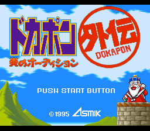 | 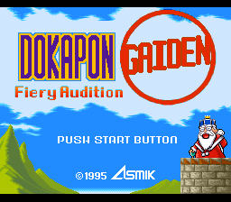
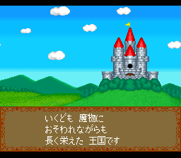 | 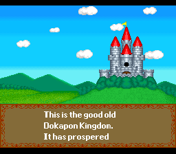
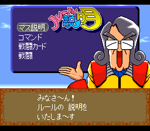 | 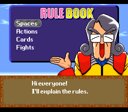
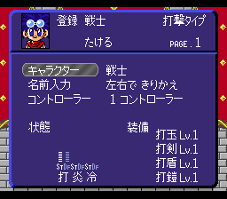 | 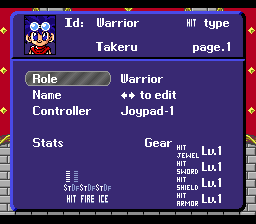
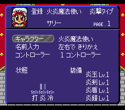 | 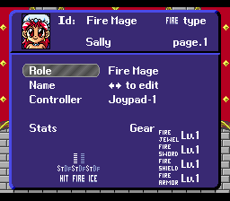
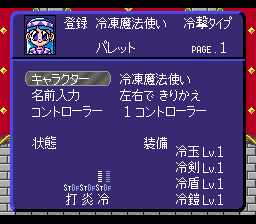 | 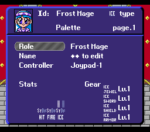
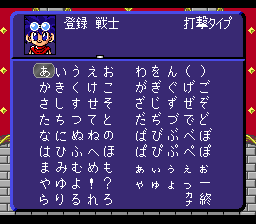 | 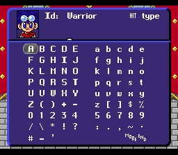
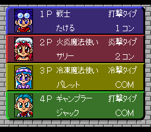 | 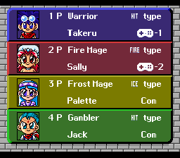
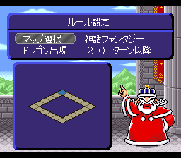 | 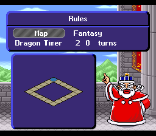
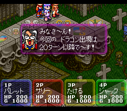 | 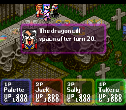
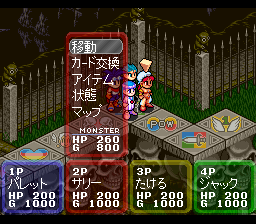 | 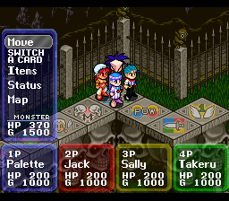

## Translations

### Main Menu

Mode | Comment
--- | ---
Versus | Plays 1 to 4 players, with any Human/CPU mix, on a single map.
Audition Contest | Story mode for 1 player versus 3 CPUs over 4 maps. The player must finish 1st or 2nd to progress and finish 1st on the 4th map to win. A password is provided between each map to keep track of the progression.
Rules | Rules explanation by the Dokapon minister.
Password | Only used to load a story mode game.

### Characters

The 6th playable class is 美少女戦士 (Bishōjo Senshi). 
It literally means "Pretty Warrior". 
It's a reference to the manga/anime, popular when I was a kid, Sailor Moon (美少女戦士セーラームーン, Bishōjo Senshi Sērā Mūn). 
In English speaking countries, they used the terms "Sailor Guardians" or sometimes "Pretty Guardians". 
I went for the translation "Sailor Senshi", as it is shorter while being close to the Japanese term (セーラー戦士, Sērā Senshi) which is also used. 

### Fight Types

Japanese | English | Comment
--- | --- | ---
全員戦闘 (Zen'in sentō) | Brawl | 全員戦闘 means 'fight with everybody'. Hence the translation 'brawl'.
モンスター戦闘 (Monsutā sentō) | Monster Battle | 
スタック戦闘 (Sutakku sentō) | Showdown | スタック戦闘 means 'stack fight' (borrowing the English word stack). I use the term 'showdown' as 'stack fight' doesn't carry much meaning.
ドラゴン戦闘 (Doragon sentō) | Dragon Battle | 

### Items

Image | Name | Comment
--- | --- | ---
 | Herb | Heals all HP.
 | 1-Move Ticket | Grants 1 move (has variants from 1 to 6).
 | Duel Card | Triggers a showdown with the selected player.
 | Brawl Card | Triggers a brawl.
 | Insurance Medal | The wearer keeps their gold when they die.
 | Talisman Medal | The wearer is protected from thieves, hitmen and collectors.
 | Minister Ticket | Worth 300G at the end of the game. Does not take inventory slots.
 | Royal Ticket | Worth 500G at the end of the game. Does not take inventory slots.

In the Japanese version, the Duel and Brawl cards have a different sprite (the same for both):  
It's a card that reads 決闘 which means "Duel". I changed it for a sprite of two crossed swords as writing "Duel" on the card that's also used for the Brawl would've been confusing.

### Japanese puns

Rival the Prankster Dragon (in the original version: ダジャレドラゴン
こんぺ~ Dajare Doragon - Konpe the Pun Dragon) has two special attacks that are puns.

[More info on the concept of Dajare](https://en.wikipedia.org/wiki/Dajare)

The first one is 
フトンが ふっとんだ (Futon ga futtonda) 
布団が吹っ飛んだ (in Kanji) 

Translation: 
Futon was blown away.

Explanation: 
布団 (Futon) means "a Japanese style mattress" 
吹っ飛んだ (futtonda) means being blown away.

The second attack is 
ダジャレをいうのは ダレじゃ! 
ダジャレを言うのはだれじゃ! (dajare o iu no wa dare ja)
"Who says Dajare!"

It's actually a children song whose lyrics are all puns (including the futon pun).
Usually sung with a choreography as shown [there](https://youtu.be/m_8Un4-gtWw).

As the puns are language dependant, both attacks have been adapted as silly jokes which I'll let you discover in the game.
